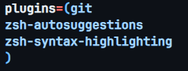

# Установка новой оболочки и дополнения
pacman -S zsh

esho buvaut takie shrifti hehehe

sh -c "$(curl -fsSL https://raw.githubusercontent.com/ohmyzsh/ohmyzsh/master/tools/install.sh)"

chsh -s $(which zsh)

## Плагины для oh my zsh

### 
git clone https://github.com/zsh-users/zsh-syntax-highlighting.git ${ZSH_CUSTOM:-~/.oh-my-zsh/custom}/plugins/zsh-syntax-highlighting

zsh-syntax-highlighting — добавить в тело plugins название плагина

git clone https://github.com/zsh-users/zsh-autosuggestions ${ZSH_CUSTOM:-~/.oh-my-zsh/custom}/plugins/zsh-autosuggestions

zsh-autosuggestions – добавить в тело plugins название плагина

#
pacman -S needed git base-devel

git clone https://aur.archlinux.org/yay.git

Создай нового пользователя, выдай ему права wheel

sudo usermod -aG wheel <newuser>

В файле /etc/sudoers раскомментировать строчку %wheel ALL=(ALL) ALL

Зайти в папку с yay

И из-под нового пользователя 

makepkg -si

# Как установить шрифт и/или иконки
*** ЭТО ДЛЯ ВСКОДА

https://www.nerdfonts.com/font-downloads

Устанавливаем нужный пропатченный шрифт, например Fira Code Nerd Font 
(очень важно, если вам нужны иконки устанавливайте именно пропатченные шрифты, часто с припиской Nerd)

В конфиге VSCode F1 => User Settings
Добавляем/заменяем строки
    "terminal.integrated.fontFamily": "название шрифта",
    "terminal.integrated.fontLigatures.enabled": "true",

**** ЭТО  ДЛЯ ТЕРМИНА ВНУТРИ ЛИНУКС
pacman -Ss '.*<нужное название>.*', ищем нужный пакет, например

pacman -Ss '.*nerd.*' и скачиваем например ttf-firacode-nerd и ttf-nerd-fonts-symbols

Обновляем кэш шрифтов fc-cache -fv

Можно посмотреть какие шрифты установлены fc-list

Располагаются здесь ls /usr/share/fonts

Создать конфигурационный файл для шрифтов ~/.config/fontconfig/fonts.conf

Базовый шаблон для ~/.config/fontconfig/fonts.conf
<?xml version='1.0'?>
<!DOCTYPE fontconfig SYSTEM 'fonts.dtd'>
<fontconfig>

 <alias>
  <family>sans-serif</family>
  <prefer>
   <family>Noto Sans Cond</family>
  </prefer>
 </alias>

 <alias>
  <family>serif</family>
  <prefer>
   <family>Noto Serif</family>
  </prefer>
 </alias>

 <alias>
  <family>monospace</family>
  <prefer>
   <family>Noto Sans Mono</family>
  </prefer>
 </alias>

</fontconfig>

https://code.visualstudio.com/docs/terminal/appearance
